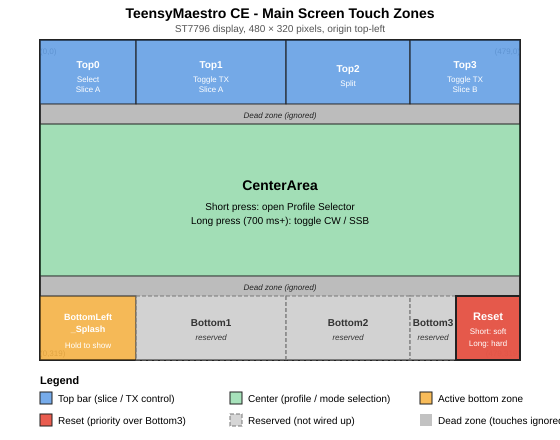

# TeensyMaestro - Community Edition (CE)

**Community-maintained open-source edition of TeensyMaestro for FlexRadio 6000, 8000, and Aurora radios.**
Based on the original [TeensyMaestro by Len Koppl (KD0RC)](https://github.com/KD0RC/Teensy-Maestro-for-Flex-6000-radios).

---

## 🧩 Overview

TeensyMaestro - Community Edition (CE) is a non-commercial, open-source firmware for the **Teensy 4.1** microcontroller.
It provides a rich front-panel control interface for FlexRadio transceivers, focusing on usability, network resilience, and expandability.

This firmware is intended for technically inclined users who are comfortable flashing microcontrollers and working with community-supported software.

---

## ⚙️ Hardware Support

- **Supported:** TeensyMaestro Hardware Version 2 (only)
  - Display: ST7796 (480×320) with XPT2046 touchscreen
  - I/O expanders: MCP23017 (main) + optional MCP23008 muxes

- **Not supported:** TeensyMaestro Hardware Version 1

If you are not sure which hardware revision you have, assume it is **not** supported until you have verified your PCB and parts against the Hardware v2 design.

---

## 🚀 Installing TeensyMaestro CE on your TeensyMaestro v2

There are two main ways to get TeensyMaestro CE onto your **Teensy 4.1**:

1. **Recommended:** Flash the latest prebuilt firmware from GitHub Releases.
2. **Advanced:** Build the firmware yourself and flash your own binary.

For almost all users, **option 1 is strongly recommended**.

In addition to flashing the firmware, you also need to place the CE version of `MMConfig.ini` on the SD card (see below). Both pieces are required for CE to operate correctly.

### 📋 Required: Install the CE version of MMConfig.ini on the SD card

TeensyMaestro CE uses an extended version of `MMConfig.ini` with additional configuration keys. The CE file format differs from the original TeensyMaestro's; always use the CE version bundled in this repository.

1. Download the CE version from:
   `https://raw.githubusercontent.com/tnxqso/TeensyMaestro/refs/heads/main/firmware/TeensyMaestro/config/MMConfig.ini`
2. Place it in the **root** of the SD card that you use with your TeensyMaestro.
3. Start with minimal edits. The syntax is strict and a single malformed line can prevent TeensyMaestro from starting correctly. Get the radio working with the supplied configuration first, then add customisations incrementally and test after each change.

### ✅ Option 1 - Use a prebuilt firmware (recommended)

1. Go to the TeensyMaestro CE Releases page:
   `https://github.com/tnxqso/TeensyMaestro/releases`
2. Download the **latest release** for TeensyMaestro CE (HEX file or the "compiled binary" bundle).
3. Install the official **Teensy Loader** application from PJRC (Windows/macOS/Linux).
4. Connect your TeensyMaestro v2 (with Teensy 4.1) to your computer via USB.
5. In Teensy Loader:
   - Open the downloaded `.hex` file.
   - Press the **PROGRAM** button on the Teensy (if required).
   - Click **Program** and wait until the flashing process finishes.
6. Power-cycle or reset the TeensyMaestro, and the new CE firmware should start.

This is the easiest and safest way to run TeensyMaestro CE.
If you only want to use the firmware and not modify the code, **do not bother setting up a build environment**.

### 🧠 Option 2 - Build the firmware yourself (advanced)

Only consider this if you are already comfortable with:

- C++ development for embedded targets
- PlatformIO, or equivalent build systems
- Debugging toolchain and environment issues on your own

The CE maintainers build against **Teensy 4.1** using the `teensy` platform and `arduino` framework under PlatformIO. For the exact library versions and build configuration, see `platformio.ini` in the repository; that file is the single source of truth and stays in sync with the code as the project evolves.

#### Important build-support disclaimer

- Setting up a working build environment for TeensyMaestro CE is **non-trivial**.
- The TM CE team maintainers **do not provide support** for:
  - PlatformIO installation problems
  - Toolchain issues
  - Local library version conflicts
  - General "how do I build this?" questions

If you are an experienced developer, this should be enough information to get going.
If you are not, you are much better off **sticking to the prebuilt firmware from GitHub Releases**.

---

## 🌐 Key Features

- **WinKeyer v2 Emulation (TM WK)**
  - Presents TeensyMaestro as a K1EL WinKeyer v2-compatible CW keyer over either USB serial or TCP, so most logging and contest software can key the radio through TeensyMaestro with no special driver.
  - Non-blocking, poll-based timing; paddle input can break in and take over from host-generated CW.
  - Host and front-panel WPM stay in sync; speed changes flow both ways.
  - WinKey "Clear Buffer" (ESC) is honoured for in-flight CW and ignored when the keyer is already idle, to avoid eating the next macro.
  - Tested with **DXLog.net**, **N1MM**, **DXLab**, and **SkookumLogger**. Other WinKey v2-capable loggers should work.
  - Some areas are deliberately simplified: the `weighting` register is stored but not yet applied to element shaping, and a few rarely-used admin queries return compatible defaults. See `WK_README.md` and `WINKEYER_PROTOCOL_V2_EMULATION.md` for details.

- **STUN/NAT Traversal and Fixed-IP Operation**
  - Supports remote operation even when your TeensyMaestro is behind NAT or firewalls.
  - Suitable for fixed-station and "remote shack" setups.

- **NTP Support**
  - Periodically synchronizes the internal clock against NTP servers.
  - Ensures accurate UTC display for logging and contest operation.

- **QSY Selector**
  - A full-screen band and mode selector, opened with a short press in the centre of the display.
  - Two actions, selected with `Selector Action` in `MMConfig.ini`:
    - `PROFILE` loads a SmartSDR Global Profile, composed from the chosen band and mode using the `Profile Map` table.
    - `BANDMODE` applies the band directly to the panadapter owning the active slice, then optionally applies a mode to that slice. Use this if you set up bands and modes in your SDR client rather than through global profiles.
  - See the Touch Zones section for the full behaviour of both actions.

- **Enhanced User Interface**
  - Clock widget and cleaner slice displays.
  - Tweaked layouts and visual consistency for Hardware v2.

- **Hardware v2 Optimisations**
  - Tuned specifically for the ST7796 display and MCP23017-based front panel found on Hardware v2.

---

## 🔀 Differences from original TeensyMaestro

TeensyMaestro CE adds a number of things on top of the original firmware by Len Koppl (KD0RC). The notable additions, in rough order of user impact:

- **Rewritten keyer engine.** CE's CW keyer is a ground-up rewrite with responsiveness and paddle feel as the primary design goals. Non-blocking timing, break-in handling, and paddle response are tuned for smooth interactive use.
- **WinKeyer v2 emulation (TM WK).** CE includes a built-in WinKeyer v2 emulator so contest and logging software can key your radio through TeensyMaestro over USB serial or TCP. See the Key Features section and `WK_README.md` for details.
- **Extended MMConfig.ini.** CE recognises additional configuration keys. The CE and original configuration files are not interchangeable; always use the CE version from this repository (see the installation section).
- **Touch screen layout.** CE defines a specific set of touch zones including a QSY Selector modal (bands and modes), a soft/hard Reset region in the lower right, and a splash overlay in the lower left corner. See the Touch Zones section below.
- **STUN/NAT traversal and fixed-IP operation.** CE includes infrastructure for remote operation through NAT or a firewall.
- **NTP clock sync and clock widget.** CE periodically syncs its internal clock via NTP and shows it on the main screen.

---

## 👆 Touch Zones

TeensyMaestro CE uses a specific touch-zone layout on the ST7796 480×320 display. The map below applies to the **main screen** during normal operation (no modal open).

### Main screen zones

| Zone | Pixel bounds (x1, y1) - (x2, y2) | Short press | Long press (700 ms+) |
|---|---|---|---|
| `Top0` | (0, 0) - (96, 64) | Select Slice A | (logged only) |
| `Top1` | (96, 0) - (246, 64) | Toggle TX on Slice A | (logged only) |
| `Top2` | (246, 0) - (370, 64) | Split: create Slice B from A | (logged only) |
| `Top3` | (370, 0) - (480, 64) | Toggle TX on Slice B | (logged only) |
| `CenterArea` | (0, 84) - (480, 236) | Open QSY Selector modal | Toggle CW / SSB |
| `BottomLeft_Splash` | (0, 256) - (96, 320) | Hold to show splash overlay; releases on lift | (no long-press threshold) |
| `Bottom1` | (96, 256) - (246, 320) | Reserved | Reserved |
| `Bottom2` | (246, 256) - (370, 320) | Reserved | Reserved |
| `Bottom3` | (370, 256) - (480, 320) | Reserved | Reserved |
| `ResetButton` | (416, 256) - (480, 320) | Soft reset (redraw + screensaver reset) | Hard MCU reset |

Two narrow horizontal strips at `y=64..84` and `y=236..256` are dead zones that intentionally ignore touches to reduce accidental activation between the top, center, and bottom rows.

The `ResetButton` sits inside the right portion of `Bottom3`. Reset is hit-tested first and takes priority, so `Bottom3` never fires in that corner. This is intentional.

### QSY Selector modal - Bands page

Opened by a short press in `CenterArea`. Full-screen grid of 3 × 4 cells, 152×72 px with 6 px gaps.

| Zone | Pixel bounds | Action |
|---|---|---|
| `Band_160m` | (6, 6) - (158, 78) | Select 160 m, advance to Modes page |
| `Band_80m` | (164, 6) - (316, 78) | Select 80 m |
| `Band_60m` | (322, 6) - (474, 78) | Select 60 m |
| `Band_40m` | (6, 84) - (158, 156) | Select 40 m |
| `Band_30m` | (164, 84) - (316, 156) | Select 30 m |
| `Band_20m` | (322, 84) - (474, 156) | Select 20 m |
| `Band_17m` | (6, 162) - (158, 234) | Select 17 m |
| `Band_15m` | (164, 162) - (316, 234) | Select 15 m |
| `Band_12m` | (322, 162) - (474, 234) | Select 12 m |
| `Band_10m` | (6, 240) - (158, 312) | Select 10 m |
| `Band_6m` | (164, 240) - (316, 312) | Select 6 m |
| `Bands_Cancel` | (322, 240) - (474, 312) | Close selector, return to main screen |

In the `BANDMODE` action the band is applied to the radio immediately when you pick it, before the Modes page opens. In the `PROFILE` action nothing is sent until a mode has also been chosen.

### QSY Selector modal - Modes page

Appears after a band is chosen. 2 × 3 cells, 228×96 px with 8 px gaps. A 200 ms arm-guard prevents an accidental "through-press" from the Bands page.

The tiles depend on `Selector Action`.

#### Modes page with `Selector Action: PROFILE`

The tile labels are components of a Global Profile name, not radio modes. The chosen band and mode are looked up in the `Profile Map` table in `MMConfig.ini` and the resulting profile is loaded. The profile decides frequency, mode, filters and antenna.

| Zone | Pixel bounds | Enabled for | Action |
|---|---|---|---|
| `Mode_SSB` | (8, 8) - (236, 104) | All bands except 30 m | Load profile, close selector |
| `Mode_CW` | (244, 8) - (472, 104) | All bands | Load profile, close selector |
| `Mode_FM` | (8, 112) - (236, 208) | 10 m and 6 m only | Load profile, close selector |
| `Mode_DIGU` | (244, 112) - (472, 208) | All bands | Load profile, close selector |
| `Mode_Empty` | (8, 216) - (236, 312) | Never (disabled slot) | Ignored |
| `Modes_Cancel` | (244, 216) - (472, 312) | Always | Close selector, return to main screen |

#### Modes page with `Selector Action: BANDMODE`

The tile labels are real slice modes, sent to the radio as-is. There is no combined SSB tile: USB and LSB are separate, so no automatic sideband choice is made on your behalf.

| Zone | Pixel bounds | Enabled for | Action |
|---|---|---|---|
| `Mode_CW` | (8, 8) - (236, 104) | All bands | Set mode on active slice, close selector |
| `Mode_USB` | (244, 8) - (472, 104) | All bands except 30 m | Set mode on active slice, close selector |
| `Mode_LSB` | (8, 112) - (236, 208) | All bands except 30 m and 60 m | Set mode on active slice, close selector |
| `Mode_FM` | (244, 112) - (472, 208) | 10 m and 6 m only | Set mode on active slice, close selector |
| `Mode_DIGU` | (8, 216) - (236, 312) | All bands | Set mode on active slice, close selector |
| `Modes_Cancel` | (244, 216) - (472, 312) | Always | Close selector, keep the band change |

Notes on the `BANDMODE` mode page:

- Choosing a mode is optional. Cancel, or letting the page time out, keeps the band change already made and leaves the mode as the radio set it.
- A 5 px marker shows which tile matches the mode the radio is currently in. It updates as the radio's band stack settles after the band change, so it may move a moment after the page opens.
- 30 m is a CW and digital band with no phone allocation, so USB and LSB are disabled there.
- Only USB is used on 60 m, so LSB is disabled there.
- FM is disabled below 10 m. Wide modes on the lower bands are discouraged by band plan recommendations. This is guidance rather than a legal restriction, so the rule is a convenience default.
- A mode chosen within 750 ms of the band change is held briefly before being sent, so it cannot be overwritten by the radio's band stack recall. The selector stays open until it has been sent.

### Menu screen

When the menu is open (`MenuActive == true`), the display switches to a list view. Each visible menu row is a full-width touch strip, 21 px tall, stacked from the top. A short press on row `N` writes `N × CWEncSteps` to the menu encoder, equivalent to moving the encoder to that item and clicking it. The number of rows is dynamic and depends on how many items the current menu contains.

### Developer notes

The main-screen touch dispatch lives in `tm_touch.h`. The QSY Selector modal is handled in `tm_qsy_select.cpp`. Raw-touch-to-pixel calibration constants are in `tm_touch_helpers.h`. The main touch entry point is in `TeensyMaestro.ino` (look for `GotTouch` and `TouchDispatch`).

---

## 🆘 Getting Help and Reporting Problems

This is a **community edition** with **no formal support contract**. All work is done by volunteers, in spare time.

Before you open an issue or ask for help, please read and follow these points:

### 1. Do not contact the original author about CE-specific issues

- **Len Koppl (KD0RC)** is the original author of TeensyMaestro.
- TeensyMaestro **Community Edition (CE)** adds and changes features that Len did not design, ship, or support.
- If something is broken in **CE only**, do **not** ask Len about it. He is not responsible for CE bugs or behavior.

### 2. First compare with the official TeensyMaestro firmware

If you suspect a bug in CE:

1. Check whether the same behavior occurs with the **original, official TeensyMaestro firmware** from Len's repository.
2. If the problem **also** exists there, it is not a CE-specific bug. In that case:
   - Search Len's GitHub and documentation to see if it is a known limitation.
   - Only report it upstream if it clearly looks like a bug in the original firmware.
3. Only if the issue is unique to CE should you open an issue in the **CE repository**.

In short:
**If it's broken in both original and CE, it's not our bug alone.
If it's only broken in CE, then it's ours.**

### 3. How to open a useful GitHub issue

When you are sure the problem is CE-specific, use GitHub Issues in the usual way:

- Clearly state:
  - **Radio model and firmware**,
  - **TeensyMaestro CE version / commit**,
  - **PC OS, logger software, and version** (e.g. "Windows 11, DXLog 2.x, N1MM 1.x", "macOS + SkookumLogger").
- Describe:
  - What you **expected** to happen.
  - What **actually** happened.
  - Whether the issue is reproducible and **exact steps** to reproduce it.
- Attach:
  - Relevant logs (e.g. **SD trace logs**, serial logs, WinKey traces) if available.
  - Screenshots if helpful.

The clearer and more complete your report is, the more likely someone in the community will be able to reproduce and fix it.

### 4. No guaranteed response time

- There is **no dedicated support team** and no guaranteed response time.
- Issues will be handled by the CE contributors **as time permits**.
- Some issues may be closed if they are not reproducible, lack enough detail, or fall outside the design scope of TeensyMaestro CE.

If you need guaranteed support or commercial-level reliability, you should not rely solely on this firmware.

---

## 📜 License & Credits

This project is licensed under **Creative Commons Attribution-NonCommercial-ShareAlike 3.0 (CC BY-NC-SA 3.0)**.
See [`LICENSE.md`](LICENSE.md) for full details.

### Credits

- **Original work:** Len Koppl (KD0RC)
- **FlexRadio 6000 library:** Vincenzo Stefanazzi (IW7DMH)
- **Community maintenance and extensions:** TNX QSO and contributors

---

## 📘 Links

### Original Project & Documentation

- **Original TeensyMaestro firmware (KD0RC)**
  Official upstream repository by the original author, Len Koppl.
  https://github.com/KD0RC/Teensy-Maestro-for-Flex-6000-radios

- **TeensyMaestro User Manual (DOCX)**
  Original user manual covering hardware operation, menus, and usage concepts.
  https://github.com/KD0RC/Teensy-Maestro-for-Flex-6000-radios/raw/refs/heads/master/TeensyMaestro%20User%20Manual.docx

---

### Hardware Design & Schematics (v2)

- **TeensyMaestro Hardware Repository**
  Schematics, PCB files, and hardware design sources for TeensyMaestro.
  https://github.com/rimuadmin/TeensyMaestro-Hardware

- **TeensyMaestro Hardware Wiki**
  Hardware build notes, revisions, BOM details, and assembly guidance.
  https://github.com/rimuadmin/TeensyMaestro-Hardware/wiki

---

### Community & Discussion

- **FlexRadio Community - TeensyMaestro Thread**
  Long-running discussion with user experiences, troubleshooting, and background.
  https://community.flexradio.com/discussion/8023866/teensymaestro/

---

### Kits & Commercial Hardware

- **TeensyMaestro v2 Hardware Kit (G7UFO Radio Shop)**
  Commercially available TeensyMaestro hardware kit based on the v2 design.
  https://shop.g7ufo.radio/products/kit-teensy-maestro?variant=52210433687890

---

### Project-Specific References

- **License - Creative Commons BY-NC-SA 3.0**
  https://creativecommons.org/licenses/by-nc-sa/3.0/

- **WinKey Emulation Overview**
  [WK_README.md](WK_README.md)

- **WinKey Protocol Notes**
  [WINKEYER_PROTOCOL_V2_EMULATION.md](WINKEYER_PROTOCOL_V2_EMULATION.md)

- **Changelog**
  [CHANGELOG.md](CHANGELOG.md)

---

© 2015-2026 Len Koppl (KD0RC), Vincenzo Stefanazzi (IW7DMH), and contributors.
Extended and maintained by **TNX QSO**, a community developing open-source utilities for ham radio enthusiasts.